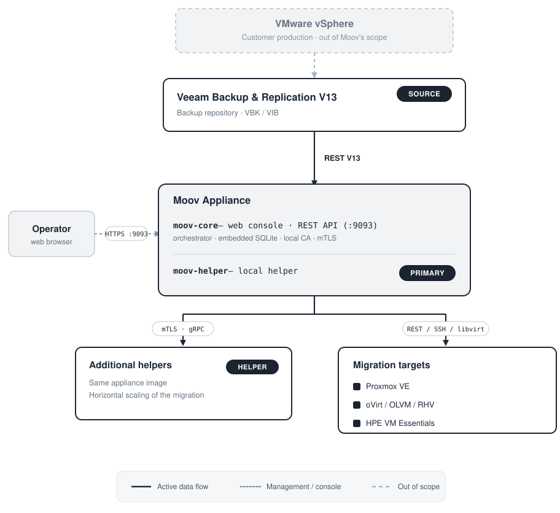
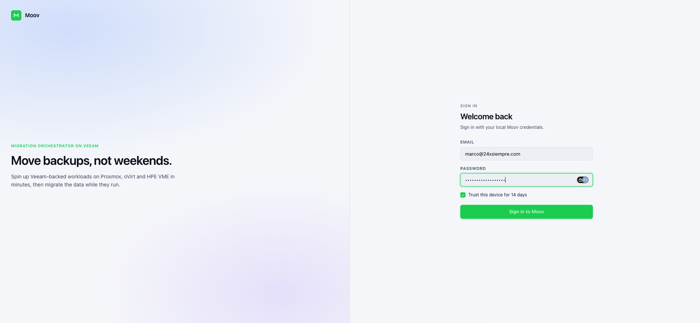
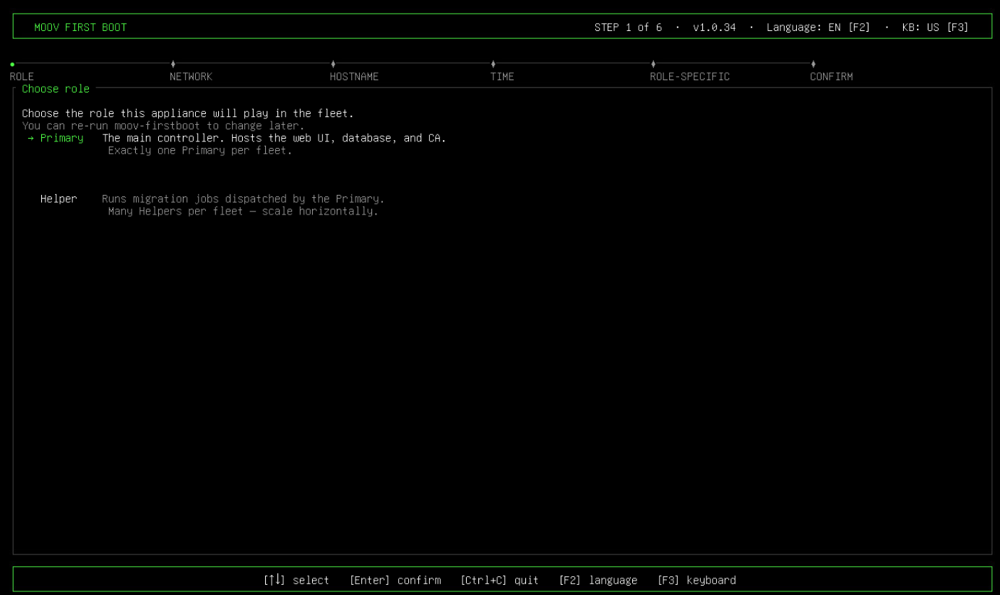
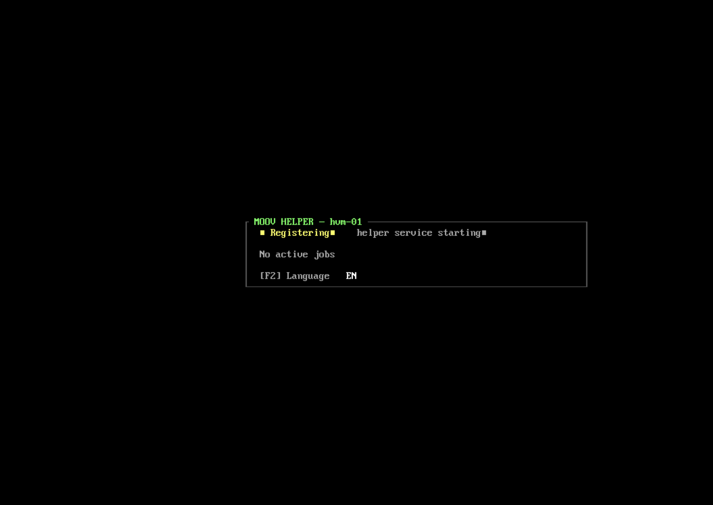

# Moov


**Mass hypervisor migration using Veeam backups as the source.**

Moov migrates virtual machines from **Veeam Backup & Replication** restore points onto modern KVM platforms - **Proxmox VE**, **oVirt / OLVM / RHV**, and **HPE VM Essentials** - without touching the source VMware vSphere environment during the migration. It closes the operational gap left by full-restore workflows: instant boot from the backup, automatic VirtIO driver handling, and concurrent waves of many VMs at once.

---

## Why Moov

Migrating a fleet off VMware traditionally means long downtime windows, manual driver injection, and one VM at a time. Moov reads directly from Veeam restore points and streams them onto the target hypervisor, so a VM can be up and serving in minutes and hundreds of VMs can move in parallel.

- **No vSphere dependency.** The source of every VM is Veeam (REST metadata or the published backup disk). Moov never connects to vCenter or ESXi.
- **Guest preparation built in.** VirtIO drivers are injected and the QEMU Guest Agent (QGA) is installed automatically, so the migrated VM boots with working storage and network and reports status to the hypervisor. Modern Windows uses inbox drivers.
- **Network preserved.** Static IPs and multi-NIC layouts are carried over to the migrated VM, or reassigned per NIC from the console.
- **Runs as an appliance.** A self-contained image with a first-boot setup wizard and a web console - no external identity provider or database to stand up.

## Migration modes

| Mode | RTO | When to use |
|---|---|---|
| **Instant Migration (IVMR)** | Minutes | Critical VMs. The VM boots directly from the backup over NBD, then pivots to local storage with no downtime. |
| **Cold Migration (Convert and Boot)** | Hours | Full materialization before boot. Best when the guest needs conversion or has no VirtIO prepped. |

Both modes run through the **Wave Engine**, which schedules many VMs concurrently with per-helper capacity limits derived from each host's CPU and RAM.

## Supported targets

| Target | Notes |
|---|---|
| **Proxmox VE 8.x / 9.x** | Full support, including automatic API-token bootstrap. |
| **oVirt 4.5+ / OLVM / RHV** | REST + imageio upload; SSH/QMP for instant migration. |
| **HPE VM Essentials (Morpheus 8.1.x / 9.x)** | Instant and cold migration onto MVM nodes. |

Source: **Veeam Backup & Replication V13** REST API.

## Guest OS compatibility

- **Linux** - enterprise distributions with VirtIO support (RHEL / Rocky / AlmaLinux, Ubuntu, Debian, SUSE, and derivatives). Static IP and multi-NIC layouts are preserved.
- **Windows** - Server 2012 R2 through Server 2025, and desktop Windows 10 / 11. Modern Windows boots on inbox VirtIO drivers; multi-NIC static IPs are applied per interface.

## Requirements

**Minimum resources**

| Role | vCPU | RAM | Disk |
|---|---|---|---|
| **Moov appliance** (Core + built-in helper) | 8 | 8 GB | 50 GB |
| **Dedicated helper** | 8 | 16 GB | 50 GB |

Helpers do heavy CPU, memory, and I/O work (`qemu-img`, `virt-v2v`, and sparsify over full disks), so under-sizing lengthens conversions or risks out-of-memory on large disks. A helper's parallel capacity scales with its resources - see [Sizing & parallelism](#sizing--parallelism). The auto-deploy wizard uses **8 vCPU / 16 GB / 50 GB** by default on all three hypervisors.

**Also required**

- A **Veeam Backup & Replication V13** server with the REST API enabled, and image-level backups of the VMs you want to migrate.
- At least one **target hypervisor**: Proxmox VE 8/9, oVirt 4.5+ / OLVM / RHV, or HPE VM Essentials (Morpheus 8.1.x / 9.x).
- **Network reachability**: the appliance reaches Veeam and the target hypervisor APIs; helpers reach the Core and the Veeam Mount Server; operators reach the console over HTTPS.
- No internet access is required during migrations - Moov is air-gap friendly.

## Connectivity & ports

Moov reaches each system over its standard management API - it never contacts vSphere.

- **Veeam Backup & Replication** - REST API over HTTPS (default `:9419`). To stream a disk, Moov uses the Veeam **Data Integration API**, which publishes the restore point as an iSCSI target on the Veeam **Mount Server**; helpers attach it over iSCSI (`:3260`).
- **Proxmox VE** - REST API over HTTPS (`:8006`) with an API token (auto-bootstrapped). Instant migration also uses **SSH** (`:22`) to the node for local disk operations and QMP.
- **oVirt / OLVM / RHV** - REST API over HTTPS (`:443`) with SSO; disk upload uses the **imageio** service (`:54322` on the SPM host, `:54323` on the engine). Instant migration also uses SSH / QMP.
- **HPE VM Essentials (Morpheus)** - REST API over HTTPS (`:443`) with OAuth; instant migration uses **libvirt / SSH** on the MVM nodes.

Operators reach the appliance from a browser; helpers talk to the Core over mutual TLS.

| Port | Protocol | Direction | Purpose |
|---|---|---|---|
| `9093` | HTTPS | Operator → appliance | Web console, REST API, and helper registration |
| `80` / `443` | HTTP/S | Operator → appliance | Redirect (301) to `:9093` |
| `9091` | mTLS gRPC | Appliance ↔ helpers | Job dispatch and heartbeat / events |
| `9094` | HTTP | Helper → appliance | Pull the helper binary + CA during auto-provisioning |
| `9419` | HTTPS | Appliance → Veeam | Veeam B&R REST API |
| `3260` | iSCSI | Helper → Veeam Mount Server | Attach the published backup disk |
| `8006` | HTTPS | Appliance → Proxmox VE | Proxmox REST API |
| `443` | HTTPS | Appliance → oVirt / Morpheus | oVirt / HPE VME REST API |
| `54322`–`54323` | HTTPS | Appliance / helper → oVirt | imageio disk upload |
| `22` | SSH | Appliance / helper → hypervisor node | Instant migration (libvirt / QMP / disk ops) |

Ports for Veeam and the target hypervisors are their standard defaults; the actual value comes from the connection URL you configure.

## How it works

Moov ships as a **Core appliance** plus lightweight, disposable **helper VMs** deployed on the target hypervisor:

1. The **Pre-flight Inspector** scans Veeam backups, classifies each VM (OS, disks, VirtIO readiness), and estimates capacity.
2. The operator plans a **wave** in the web console and picks a target host and migration mode per VM.
3. The Core publishes the restore point from Veeam and dispatches the work to a **helper**, which serves the disk over NBD, injects VirtIO drivers and the guest agent, and drives the conversion/boot.
4. Progress streams live to the console; the migrated VM boots, the guest agent comes online, and (for instant migration) the disk pivots to local storage.

Helpers communicate with the Core over mutual TLS and hold no persistent state - they re-register after a restart.

## Architecture



Moov is delivered as a single **appliance** with a web console. It has three moving parts:

- **Core** - the orchestrator behind the web console and REST/SSE API (`:9093`). It manages connections, plans and runs waves, holds the local certificate authority for mutual TLS, and stores its state in an embedded database on the appliance. Operators reach it from a browser over HTTPS.
- **Helpers** - disposable worker VMs that do the heavy lifting of each migration (serving the backup disk over NBD, conversion, boot). The appliance includes a built-in local helper; **additional helpers** deployed on the target hypervisors scale the migration horizontally. All helpers run the same appliance image and authenticate to the Core over mutual TLS.
- **Targets** - the destination hypervisors (Proxmox VE, oVirt / OLVM / RHV, HPE VM Essentials), reached over their REST APIs plus SSH / libvirt where instant migration requires it.

The only inbound source is **Veeam Backup & Replication V13**, over its REST and Data Integration APIs. The original VMware vSphere environment is never contacted.

## Getting started

1. **Deploy the appliance** image on any hypervisor and complete the first-boot wizard (role, network, hostname, time).
2. **Open the web console** and sign in.
3. **Connect** your Veeam Backup & Replication server and at least one target hypervisor. Proxmox can bootstrap its API token automatically.
4. **Set the target defaults** on each connected hypervisor - the default node/cluster (or group/zone), storage, and network bridge that migrations and helper deployment will use.
5. **Deploy one or more helpers** on the target hypervisor - auto-deploy from the console.
6. **Run the Pre-flight Inspector** to scan and classify the VMs.
7. **Plan a wave**: pick VMs, targets, and a migration mode, then launch and watch progress live.



## Features

**Migration**
- Instant Migration (IVMR) - boot from the backup over NBD, then pivot to local storage with no downtime.
- Cold Migration (Convert and Boot) - full materialization, then boot.
- All three targets: Proxmox VE, oVirt / OLVM / RHV, HPE VM Essentials.
- **Guest preparation**: injects VirtIO drivers into guests that need them and installs the QEMU Guest Agent (QGA). Modern Windows uses inbox VirtIO drivers; Windows Server 2025 supported.
- Multi-disk VMs; automatic destination-name sanitization per hypervisor.

**Pre-flight Inspector**
- Scans Veeam backups and discovers each VM's hardware: OS, CPU, RAM, disks, and network interfaces (NICs).
- Classifies each VM by VirtIO readiness so you know which migration mode fits.
- Filters to VM image backups; per-repository task budgets.
- Live updates as the scan and analysis progress.

**Networking & guest**
- Preserves static IPs; multi-NIC support for Linux and Windows (matched by MAC).
- Per-NIC IP reassignment from the console (static or DHCP).

**Helpers & scaling**
- Disposable helper VMs for horizontal scaling.
- Auto-deploy (Proxmox API-token bootstrap; oVirt and HPE).
- Resource-aware per-helper capacity, computed automatically, with a manual override.
- Automatic preference for helpers on the destination hypervisor.
- Automatic power-cycle if a freshly deployed helper does not register.

**Console & operations**
- Web console with live progress over SSE: waves, per-VM disk percentage, dashboard.
- Cancel and re-run waves; reports and an audit log.
- Email notifications, NTP, and settings from the console.
- First-boot setup wizard and an on-appliance console (see below); multi-language UI (English / Spanish / Portuguese).

**Appliance & platform**
- Self-contained appliance image; air-gap friendly (no downloads during a migration).
- Local operator authentication - no external identity provider.
- Credentials encrypted at rest (AES-256-GCM).
- Mutual TLS between Core and helpers; checksum-verified build artifacts.

## On-screen consoles (TUI)

Beyond the web console, Moov presents text-mode screens directly on the appliance and helper consoles of the hypervisor:

- **First-boot setup wizard** - walks through role, network, hostname, time, and a review step the first time the appliance boots.
- **Appliance console** - a live status screen (connection, resources, and an embedded shell) with a language switch. Administration is done from the web console; SSH is available for maintenance.
- **Helper console** - shows the helper's connection status with the appliance, heartbeat, capacity, and the jobs currently in progress, with a language switch. Helpers are administered by SSH key only.





<!-- optional: appliance console screenshot → docs/images/appliance-console.png -->

## Sizing & parallelism

Migrations run in parallel. How many VMs are in flight at once scales two ways - by making a helper bigger, and by **adding more helpers** - and Moov computes the capacity automatically from each helper's resources.

**Per helper.** Each concurrent VM needs about **1 vCPU and 2 GiB of RAM** on the helper, so a helper's capacity is whichever of the two runs out first:

```
parallel VMs per helper = min( vCPU , RAM_GiB / 2 )
```

Size a helper with roughly **2 GiB of RAM per vCPU** and both scale together linearly:

| Helper size | Parallel VMs |
|---|---|
| 4 vCPU / 8 GiB | 4 |
| 8 vCPU / 16 GiB | 8 |
| 16 vCPU / 32 GiB | 16 |
| 32 vCPU / 64 GiB | 32 |

If RAM is short relative to CPU, RAM becomes the limit - for example, 16 vCPU with only 16 GiB runs 8 in parallel (RAM-bound), not 16. Give the helper enough RAM (≈ 2 GiB per vCPU) to use all its cores.

**Multiple helpers (fleet).** The migration runs across every helper at once, so total parallelism is the **sum** of all helpers' capacity - the appliance's built-in helper plus any additional helpers you deploy on the target hypervisors. Adding helpers is the primary way to scale throughput: for example, four 8 vCPU / 16 GiB helpers migrate **32 VMs at once**. Helpers can live on different target hypervisors, and Moov prefers the ones on the wave's destination.

**Overrides and the Mount Server limit.**

- The per-helper limit can be **overridden** from the console when you want to cap or raise it.
- A second cap applies per Veeam connection: how many migrations read from each Veeam **Mount Server** at once. In **Auto** mode Moov derives it from the task limits of the repositories involved in the wave; it can also be set manually. The effective parallelism is the lower of the fleet capacity and this limit.

## Documentation

Coming soon.

## Status

**First release - v1.0.37.** Moov is in beta status, migrating VMs across Proxmox VE, oVirt, and HPE VM Essentials. This release was validated end-to-end against all three targets - instant and cold migration, Linux and Windows guests (including multi-NIC), concurrent multi-VM waves, and the full appliance lifecycle from first boot to air-gapped operation. See the changelog for what shipped.
